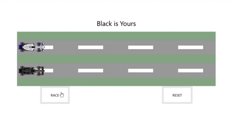

## Race Game With JS
***
- This is a game where the probability of winning depends on luck.
- I calculated the probability of winning with Math(). I put if else block for each calculation and write custom css for them.
- **There were 2 things I couldn't do;**
    - **First, I couldn't custom  transition-duration.**
    *(Actually i did but i couldn't combine it with css)*
    - **Second, I wanted to make a bet system. Each game was $50 and the money would go up and down depending on winning and losing.**

## A Gif About The Game
***

